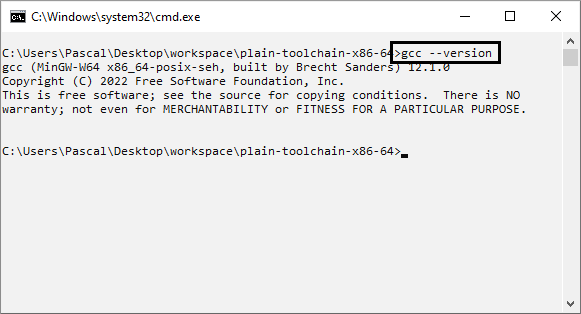

# plain-toolchain-x86-64

With this project, it become trivial to get a native C/C++ compiler on Windows:

1. Download the [latest release](https://github.com/pascalcombier/plain-toolchain-x86-64/releases) of
   plain-toolchain-x86-64 archive
2. Extract the archive in your workspace
3. Done: you have a decent C/C++ compiler on Windows!




This project is a very minimal addon to the amazing projects [GNU
GCC](http://gcc.gnu.org) and [winlibs](https://winlibs.com/). The whole point is
to have a portable way to install GNU GCC without modification of any Windows
environment variable (i.e. `%PATH%`). By doing that, the source code of the
C/C++ project can be easily re-built verbatim on other computers.

# Compile the example

Once the toolchain is downloaded and extracted, one can compile the hello-world
project. The example should compile and run out-of-the-box and the process
should be painless.

While the workspace directory name and location can be anywhere on the disk, the
directory structure is very important and cannot be changed:

```
workspace
├───plain-toolchain-x86-64
├───hello-world
├───project-1
├───project-2
├───project-n
```


# Using the GDB debugger

The GDB debugger is included in the winlibs package. To use it, simply start a
shell with `toolchain-shell-64.bat`. This command will start a shell with the
toolchain in the local `%PATH%`. From there, you can start GDB as
usual. Obviously, in order to let GDB find the source code, the binary file need
to contain the debugging information. Note that we are referring to the
command-line version of GDB, not to any graphical user interface.


# Register your own local environment variables

Advanced users may need to set environment variables locally. To do that, simply
edit the file `cmd-USER-ENVIRONMENT.bat`. If one is using the fantastic [Fossil
SCM](https://fossil-scm.org/) from Richard HIPP, he could specify the `USER`
variable in this file.

	set USER=NameOrNickname

# Integration with third-party tools

## Notepad++

A lot of develppers use the free editor
[Notepad++](https://notepad-plus-plus.org), it's pretty easy to integrate with
plain-toolchain-x86-64. It requires the plugin 'NppExec' to be installed.

### Install the plugin NppExec from the menu 'Plugins Admin...'


### Configure the Console filters


Add the custom highlight mask, so that if an error is displayed in the NppExec
console, it become highlighted and clickable.

	%FILE%:%LINE%


### Launch the compile script


One can double-click to jump to the error location.


### Successful build


## GNU Emacs

### With the standard `compile` command

Type `M-x compile` and then write down the full command line.

```
M-x compile
C:\Users\Pascal\Desktop\workspace\hello-world\make-helloworld-gui.bat
```


When the user clicks on the error line, `GNU Emacs` will move to buffer to the
error line. Press `g` in the `*compilation* buffer to recompile the project.


### With the plain-emacs-commands package

One could setup
[plain-emacs-commands](https://github.com/pascalcombier/plain-emacs-commands)
which make it very convenient to switch between compilation projects.

# Licenses

[GCC](http://gcc.gnu.org) is released under the GNU General Public License.

Winlibs information can be found [on their website](https://winlibs.com).

The very few additional files are released under BSD 2-Clause "Simplified"
License:

```
- cmd-env-64.bat
- cmd-env-64-shell.bat
- cmd-env-common.bat
- cmd-USER-ENVIRONMENT.bat
```
