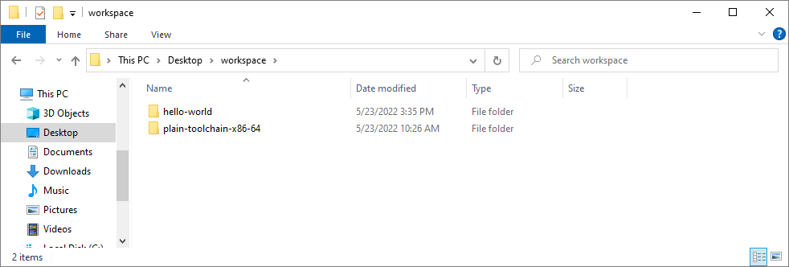

# Hello World

This file belongs to [plain-toolchain-x86-64
project](https://github.com/pascalcombier/plain-toolchain-x86-64). This is an
example of how to use the toolchain. The 2 directories need to be copied into a
workspace directory:

```
workspace
├───plain-toolchain-x86-64
├───hello-world
```



- make-helloworld-console.bat       will invoke "make"       on makefile-helloworld-console
- make-helloworld-console-clean.bat will invoke "make clean" on makefile-helloworld-console
- make-helloworld-gui.bat           will invoke "make"       on makefile-helloworld-gui
- make-helloworld-gui-clean.bat     will invoke "make clean" on makefile-helloworld-gui

So simply double-click on `make-helloworld-console.bat` and
`make-helloworld-gui.bat` It should compile and generate the executables in the
bin64 directory.

You could copy and paste the full "hello-world" directory to create your own project.
